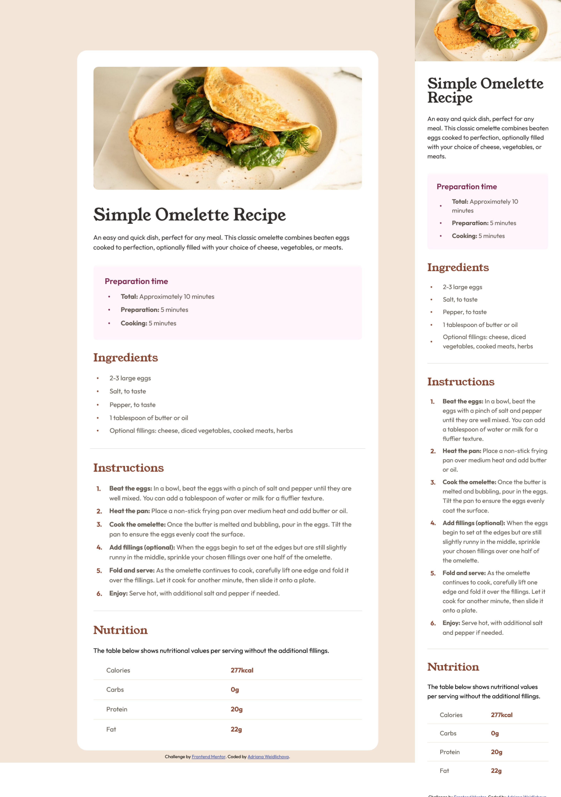

# Frontend Mentor - Recipe page solution

This is my solution to the [Recipe page challenge on Frontend Mentor](https://www.frontendmentor.io/challenges/recipe-page-KiTsR8QQKm). 

## Table of contents

- [Frontend Mentor - Recipe page solution](#frontend-mentor---recipe-page-solution)
  - [Table of contents](#table-of-contents)
  - [Overview](#overview)
    - [Screenshot](#screenshot)
    - [Links](#links)
  - [My process](#my-process)
    - [Built with](#built-with)
    - [What I learned](#what-i-learned)
    - [Continued development](#continued-development)
    - [Useful resources](#useful-resources)
  - [Author](#author)
  - [Acknowledgments](#acknowledgments)

## Overview

### Screenshot



The goal was to build a responsive recipe page that matches the design as closely as possible.

### Links

- Solution URL: [Add solution URL here](https://github.com/Saliva-sys/Recipe-page.git)
- Live Site URL: [Add live site URL here](https://saliva-sys.github.io/Recipe-page/)

## My process

### Built with

- Semantic HTML5 markup
- CSS custom properties (Variables)
- Flexbox (for layout and centering)
- Mobile-first workflow
- Media Queries for Desktop optimization

### What I learned

During this project, I focused on pixel-perfect implementation using modern CSS. I learned how to effectively use the clamp() function to create a fluid design that adapts to the screen without any sudden changes. I also tried working with CSS counters for custom list numbering and advanced table styling, which are key skills when creating templates.

Example of my desktop adjustment:

```html
<ol>
  <li><b>Beat the eggs:</b> In a bowl, beat the eggs...</li>
  <li><b>Heat the pan:</b> Place a non-stick frying pan...</li>
</ol>
```
```css
.recipe-card {
    width: 100%;
    max-width: clamp(24rem, 100%, 46rem);
    border-radius: clamp(0rem, (100vw - 30rem) * 5, 1.5rem);
}
```
### Continued development

In future projects, I want to focus on:

    - Advanced CSS Grid: Using grid for more complex layouts, such as product listings in PrestaShop.
    - Accessibility (a11y): Ensuring that all components are fully navigable by keyboard and screen readers.
    - CSS variables for Theming: Mastering CSS variables to easily switch between light and dark modes or custom brand colors for clients.

### Useful resources

- [W3Schools](https://www.w3schools.com/) - This was my go-to guide for understanding how to create fluid layouts.
- [Google Fonts](https://fonts.google.com/) - Used for the Young Serif and Outfit font family as per the design requirements.
- [MDN Web Docs - clamp()](https://developer.mozilla.org/en-US/docs/Web/CSS/clamp) - This resource helped me understand how to create fluid design without having to write dozens of Media Queries. It's the key to modern responsiveness.
- [Modern CSS Solutions](https://moderncss.dev/) - Great blog where I was looking for inspiration for semantic solutions for lists and tables.

## Author

- Frontend Mentor - [@Saliva-sys](https://www.frontendmentor.io/profile/Saliva-sys)
- GitHub - [Saliva-sys](https://github.com/Saliva-sys)

## Acknowledgments

I would like to thank the Frontend Mentor community for providing such great challenges to practice real-world web development skills.
